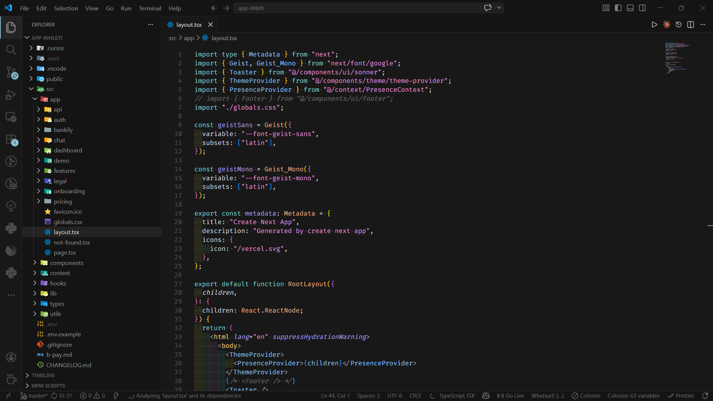

# Cursor Noir

A dark VS Code theme ported from the [Cursor](https://cursor.sh/) IDE — faithful to the original color scheme with deep blacks, subtle borders, and a carefully balanced syntax palette.

---

## Preview

  

---

## Installation

### From Open VSX (Antigravity, VSCodium, Gitpod)
1. Open the **Extensions** panel
2. Search for `Cursor Noir`
3. Click **Install**

### From VS Code Marketplace
1. Open the **Extensions** panel (`Ctrl+Shift+X`)
2. Search for `Cursor Noir` by `lhacen-med`
3. Click **Install**

### Manual (VSIX)
1. Download the latest `.vsix` from the [Releases](https://github.com/lhacen-med/cursor-noir/releases) page
2. Open Command Palette → `Extensions: Install from VSIX...`
3. Select the downloaded file

---

## Activation

1. Open Command Palette (`Ctrl+Shift+P` / `Cmd+Shift+P`)
2. Run **Preferences: Color Theme**
3. Select **Cursor Noir**

---

## Color Palette

| Role | Color |
|---|---|
| Background | `#181818` |
| Sidebar / Panel | `#141414` |
| Editor foreground | `#E4E4E4EB` |
| Accent (badges, highlights) | `#88C0D0` |
| Strings | `#e394dc` |
| Keywords | `#82D2CE` |
| Functions | `#efb080` |
| Classes / Types | `#87c3ff` |
| Numbers | `#ebc88d` |
| Properties | `#AAA0FA` |
| Comments | `#E4E4E45E` (italic) |
| Error | `#E34671` |
| Warning | `#F1B467` |
| Added (git) | `#3FA266` |
| Modified (git) | `#D2943E` |
| Deleted (git) | `#E34671` |

---

## Supported IDEs

- [Antigravity](https://antigravity.app/) — via Open VSX (default marketplace)
- [VSCodium](https://vscodium.com/) — via Open VSX
- [VS Code](https://code.visualstudio.com/) — via VS Code Marketplace
- [Gitpod](https://gitpod.io/)
- Any VS Code-compatible editor using the Open VSX registry

---

## Contributing

Found a color that looks off? Open an [issue](https://github.com/lhacen-med/cursor-noir/issues) or submit a pull request.

1. Clone the repo
2. Open the folder in VS Code / Antigravity
3. Press `F5` to launch the Extension Development Host
4. Edit `themes/cursor-noir-color-theme.json`
5. Reload the dev window to preview changes (`Ctrl+Shift+P` → Developer: Reload Window)

---

## License

MIT © [Lhacen Med](https://github.com/lhacen-med)

---

## Credits

Original theme design by the [Cursor](https://cursor.sh/) team. This extension is not affiliated with or endorsed by Cursor.